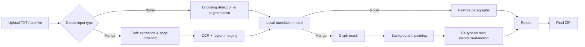

# Aoba Translator (青穗翻译台)

**English** | [简体中文](./README.zh-CN.md)

[](https://www.gnu.org/licenses/gpl-3.0.html)
[](https://www.python.org/)
[](https://github.com/Aerdelan/aoba-translator/actions/workflows/ci.yml)

A **local-first** web app that automatically translates **Japanese novels and manga** into Chinese — OCR, LLM translation, text erasure and re-typesetting all run **entirely on your own machine**. No cloud, no API keys, nothing leaves your computer.

<!-- 推广前请在此放置一张漫画翻译前后对比图（建议左右拼接，宽 1200px 左右）：

-->

## Why Aoba?

- 🖼️ **Manga + 📖 novels + 📚 EPUB in one tool** — upload a `.cbz/.zip` of manga pages, a `.txt` light novel or an `.epub` book, get a translated ZIP back. EPUB translations keep the original illustrations, styles and reading order.
- 🤖 **Any local LLM via Ollama** — defaults to Qwen 3.5 with an ACGN-tuned colloquial prompt and rolling story context; swap in Sakura/Murasaki or your own fine-tune in one config line.
- 👁️ **Vision-model OCR** — EasyOCR CRAFT detects text boxes, a local vision model (`glm-ocr`) reads them, including decorative and outlined fonts that classic OCR garbles.
- 🧹 **Non-destructive erasure** — glyph-pixel masking + OpenCV Telea inpainting removes text without painting over speech-bubble backgrounds.
- ✍️ **Faithful re-typesetting** — vertical/horizontal direction, text color and font size are estimated from the original page.
- 🧸 **Built-in diagnosis assistant "Aoba"** — paste any error into the in-app chat and the local LLM explains it using your logs and config.

## Screenshots

**1. Drop it in, the pipeline does the rest** — upload a novel `.txt` or manga `.zip/.cbz` and the five-step flow runs automatically: detect type → OCR / segment → translate → erase & re-typeset → pack ZIP. The runtime card shows model readiness and LAN access URLs.


**2. Live job queue** — every task gets a progress card; finished output stays in `data/output/` with a full `translation-report.json`.


**3. ⭐ "Aoba" — a local AI support engineer living in your app.** Click the assistant in the corner and it instantly greets you with your *actual* runtime environment: OS, CPU/GPU, model status, recent job failures — because it reads your local diagnostics before answering. Paste any PowerShell output or error log and it explains what went wrong and how to fix it. All conversations run through your local Ollama model: **your questions and logs never leave your machine**, just like your translations.


## How it works



## Quick start (Windows)

Recommended: Windows 10/11, Python 3.11, 8 GB+ RAM. CUDA is optional but speeds up OCR.

```powershell
powershell -ExecutionPolicy Bypass -File .\start.ps1
```

The script creates a virtualenv, installs dependencies, checks/installs Ollama, pulls the required models on first run and opens `http://127.0.0.1:8765`.

### Linux / macOS (manual)

```bash
python3 -m venv .venv
source .venv/bin/activate
pip install -e ".[ml,archives]"
# Ollama is required for translation and vision OCR: https://ollama.com/download
ollama pull qwen3.5:9b   # translation (2b works on low-memory machines)
ollama pull glm-ocr      # manga text recognition
python -m aoba_translator serve
```

### Model requirements

| Role | Default | Notes |
| --- | --- | --- |
| Translation | `qwen3.5:2b` | Switch to `qwen3.5:9b` for noticeably better prose |
| Vision OCR | `glm-ocr` | Robust on decorative manga fonts; slower on CPU |
| Text detection | EasyOCR CRAFT | Auto-downloaded on first run |

## Configuration

Generated at `.local/config.json` (see `config.example.json`). Highlights:

```json
{
  "translation": {
    "provider": "ollama",
    "ollama_model": "qwen3.5:9b",
    "style_profile": "acgn_colloquial",
    "context_chars": 1800
  },
  "ocr": {
    "provider": "manga",
    "vision_model": "glm-ocr"
  }
}
```

- `style_profile: acgn_colloquial` rewrites dialogue into natural spoken Chinese, infers dropped subjects from context and avoids translationese.
- Custom JP→ZH community models (Murasaki, Sakura GGUF…) can be imported into Ollama — see [`docs/TRANSLATION_MODELS.md`](docs/TRANSLATION_MODELS.md).

## Supported formats

| Type | Formats |
| --- | --- |
| Novels | `.txt`, `.md` (UTF-8 / UTF-16 / CP932 / Shift-JIS auto-detected) |
| EPUB light novels | `.epub` (paragraph-level translation; images & CSS preserved, output is a `_zh.epub`) |
| Manga pages | `.png`, `.jpg`, `.jpeg`, `.webp`, `.bmp`, `.tif`, `.tiff` |
| Archives | `.zip`, `.cbz`, `.7z`, `.rar` |

## Testing

Core tests run **without any ML dependencies**:

```bash
pip install -e .
python -m unittest discover -s tests -v
```

## Roadmap / known limits

- Glyph masking + Telea inpainting works well on speech bubbles and flat backgrounds; text over complex artwork may still leave traces (LaMa-style deep inpainting is planned as a drop-in replacement).
- Tiny kana and sound effects can be missed by detection.
- The job queue is in-memory; finished ZIPs persist in `data/output/`.

## Contributing

Issues and PRs are welcome — see the issue templates under `.github/ISSUE_TEMPLATE/`. Please keep the GPL-3.0 license terms in mind for derivatives.

## License

[GPL-3.0](./LICENSE) — free to use, modify and redistribute; derivatives must carry the same license.
