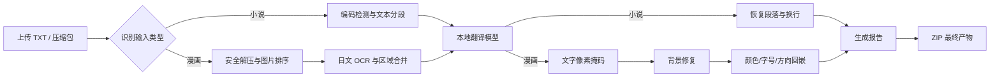

# 青穗翻译台（Aoba Translator）

一个本地优先的日文小说 / 漫画自动翻译 Web 应用。项目以 Python 为核心，不依赖前端构建工具，可在首次启动时检测运行环境、下载 OCR 与翻译模型，并将最终产物统一输出为 ZIP。

## 当前能力

- 自动识别 `TXT / Markdown` 小说、漫画图片以及图片压缩包。
- 安全解压 `ZIP / CBZ / 7Z / RAR`，防止路径穿越并限制解压体积。
- 小说按原始段落、换行和日文句号智能分段，输出 UTF-8 BOM 文本。
- 漫画使用 EasyOCR 识别日文文本区域，按相邻关系合并文本行。
- 使用本地 Hugging Face 日中模型或本机 Ollama 完成翻译。
- 从原图估算文字颜色、方向与可用字号。
- 通过“文字像素掩码 + OpenCV Telea 修复”擦除原文，避免直接涂白整个文本框。
- 支持横排与竖排中文回嵌，保留原图片目录和文件名。
- 所有结果附带 `translation-report.json`，最终压缩至 `data/output/`。
- 后台队列、实时进度、失败日志和浏览器内一键下载。

## 处理流程



## Windows 快速启动

推荐使用 Windows 10/11、Python 3.11、8 GB 以上内存。NVIDIA CUDA 不是必需项，但会明显提升漫画 OCR 和翻译速度。

```powershell
powershell -ExecutionPolicy Bypass -File .\start.ps1
```

`start.ps1` 会执行以下操作：

1. 检测 Python 3.10-3.12；未找到时可选择通过 `winget` 安装 Python 3.11。
2. 创建项目专用 `.venv`。
3. 安装 OCR、图像、翻译和压缩包依赖。
4. 启动本地服务，并在首次运行时后台拉取模型。
5. 本机打开 `http://127.0.0.1:8765`；同一局域网设备使用终端显示的 `http://<本机IP>:8765`。

依赖已安装、只想检查界面时可运行：

```powershell
.\start-lite.ps1
```

> 首次模型下载耗时取决于网络。模型准备完成后，小说和漫画内容不会发送到远端服务。

### 使用 IP / 局域网访问

服务默认监听 `0.0.0.0:8765`。启动后终端和运行状态卡会显示可访问地址，例如：

```text
http://127.0.0.1:8765
http://192.168.1.20:8765
```

手机或其他电脑需要与运行设备处于同一局域网。如果无法访问，请在 Windows 防火墙提示中允许 Python 的“专用网络”通信；不要将该端口直接暴露到公网，因为当前版本没有登录鉴权。

### 启动故障排除

如果看到 `Unable to create process` 并指向旧的 `Python311` 路径，说明已有 `.venv` 已失效。新版 `start.ps1` 会自动检测并重建它；如果本机没有 Python 3.10-3.12，先执行：

```powershell
winget install --id Python.Python.3.11 --exact --accept-package-agreements --accept-source-agreements
powershell -ExecutionPolicy Bypass -File .\start.ps1
```

如果 pip 安装失败，脚本现在会立即停止，不会继续启动一个未安装 `aoba_translator` 的服务。

## 青芽项目诊断助手

页面右下角提供悬浮 2D 玩偶“青芽”。点击玩偶即可打开本地 AI 对话窗，可直接粘贴网页报错、PowerShell 输出或任务失败信息。失败任务卡片也会显示“发给青芽”按钮。

助手通过 `POST /api/assistant/chat` 调用当前配置的本机 Ollama 模型，回答前会只读汇总以下项目上下文：

- 当前操作系统、Python、CPU/GPU 和依赖检测结果。
- 当前 OCR、翻译提供器、Ollama 模型和主要配置。
- 最近任务状态、错误消息和 `.local/logs` 中对应的失败堆栈。
- `README.md`、`docs/ARCHITECTURE.md` 与内置模块说明。

助手只分析问题并给出建议，不会执行任意 Shell 命令或自动修改文件。使用前请确保 Ollama 已启动并已拉取配置中的模型：

```powershell
ollama --version
ollama pull qwen3.5:2b
powershell -ExecutionPolicy Bypass -File .\start.ps1
```

局域网用户访问页面时，对话请求仍由运行青穗翻译台的电脑转发给该电脑上的 `127.0.0.1:11434`，手机或其他电脑无需单独安装 Ollama。当前 Web 页面没有登录鉴权，请只在可信局域网中使用，不要直接暴露到公网。

### 助手 API

```json
POST /api/assistant/chat
{
  "message": "粘贴的报错内容",
  "conversation": [
    {"role": "user", "content": "上一轮问题"},
    {"role": "assistant", "content": "上一轮回答"}
  ]
}
```

`GET /api/assistant/context` 可读取助手使用的模型名称和当前可用状态，不返回完整项目上下文。
## 命令行

激活虚拟环境后可直接使用：

```powershell
# 检查 CPU、GPU、Python 与依赖
python -m aoba_translator inspect

# 手动初始化 / 重新下载模型
python -m aoba_translator setup

# 启动 Web 服务
python -m aoba_translator serve

# 无浏览器启动
python -m aoba_translator serve --no-browser

# 直接翻译单个文件
python -m aoba_translator translate .\samples\novel.txt
```

## 支持格式

| 类型 | 格式 | 说明 |
| --- | --- | --- |
| 小说 | `.txt`, `.md` | 自动检测 UTF-8、UTF-16、CP932、Shift-JIS |
| 漫画图片 | `.png`, `.jpg`, `.jpeg`, `.webp`, `.bmp`, `.tif`, `.tiff` | 可直接上传单图 |
| 漫画压缩包 | `.zip`, `.cbz`, `.7z`, `.rar` | ZIP/CBZ 无外部工具；RAR 可能需要 7-Zip 或 unrar |

混合压缩包会根据可用图片与文本数量自动判断类型。漫画图片按相对路径和文件名自然排序前的字典序处理，建议使用 `001.jpg`、`002.jpg` 之类的文件名。

## 配置

首次运行生成 `.local/config.json`。完整示例见 `config.example.json`。

### 默认：Ollama + Qwen3 口语化模式

原来的 Marian/OPUS 日中模型只适合短句直译，缺少小说上下文和口语风格控制。当前默认改为 Ollama `qwen3.5:2b`，并启用 ACGN 口语化提示和前文上下文：

```powershell
winget install --id Ollama.Ollama --exact
ollama pull qwen3.5:2b
```

```json
{
  "translation": {
    "provider": "ollama",
    "ollama_model": "qwen3.5:2b",
    "style_profile": "acgn_colloquial",
    "temperature": 0.25,
    "context_chars": 1800,
    "context_segments": 4,
    "target_language": "简体中文"
  }
}
```

`acgn_colloquial` 会要求模型按人物关系补全省略主语、把对白改写成自然中文口语，并避免日式中文、文言化和机械连接词。

### 专用日中小说 / 漫画模型

如果更重视轻小说、Galgame 和漫画对白，可下载 Murasaki 或 Sakura 系列的 GGUF 量化模型，导入 Ollama 后把 `ollama_model` 改成自定义名称。示例：

```powershell
ollama create murasaki -f .\deploy\ollama\Modelfile.murasaki.example
```

```json
{
  "translation": {
    "provider": "ollama",
    "ollama_model": "murasaki",
    "style_profile": "acgn_colloquial"
  }
}
```

使用社区模型前请确认模型许可证是否允许你的使用场景。详细步骤见 `docs/TRANSLATION_MODELS.md`。

### 兼容 Transformers 短句模型

仍可将 `provider` 改回 `transformers` 使用旧模型，但不推荐用于整本小说或强对白漫画，因为该模式无法充分利用前文上下文和口语化指令。

### 指定回嵌字体

```json
{
  "rendering": {
    "font_path": "C:/Windows/Fonts/msyh.ttc",
    "font_min_size": 12,
    "font_max_size": 72,
    "mask_padding": 3,
    "inpaint_radius": 3
  }
}
```

Windows 默认会依次寻找微软雅黑、微软雅黑粗体和黑体；Linux 推荐安装 Noto Sans CJK。

## 目录说明

```text
.local/config.json        用户配置
.local/runtime.json       模型初始化状态
.local/logs/              失败任务堆栈
models/                   OCR 与翻译模型
 data/uploads/            上传缓存
data/work/<job-id>/      单次任务工作目录
data/output/             最终 ZIP 产物
src/aoba_translator/web/  无构建依赖的 Web 前端
```

## 背景修复说明

漫画擦除没有对整个 OCR 矩形直接覆盖纯色，而是：

1. 从文本区域边缘估算局部背景色。
2. 计算区域像素与背景色之间的色差。
3. 仅提取高差异的疑似字形像素。
4. 对字形掩码做小范围闭运算和膨胀。
5. 使用 OpenCV Telea 算法修复这些像素。

该方式对白底气泡、纯色框和轻度网点背景效果较好；文字压在人物、复杂纹理或强渐变上时，传统修复仍可能出现痕迹。架构已将修复模块独立，后续可替换为 LaMa 等本地深度修复模型。

## 已知限制与后续路线

- 当前 OCR 使用 EasyOCR；艺术字、极小假名和拟声词仍可能漏检。
- 默认日中模型体积较小，长篇文学质量不等同于大型语言模型；可以切换 Ollama。
- 回嵌采用系统字体并匹配颜色、方向、区域与字号，尚未进行字体家族识别。
- 当前任务队列保存在内存中，服务重启后历史任务卡片清空，但 ZIP 仍保留在输出目录。
- 桌面端可在现有 HTTP 服务外层使用 PyInstaller + pywebview 打包，无需重写处理核心。

## 测试

不安装 ML 依赖也可运行核心测试：

```powershell
$env:PYTHONPATH = ".\src"
python -m unittest discover -s tests -v
```


