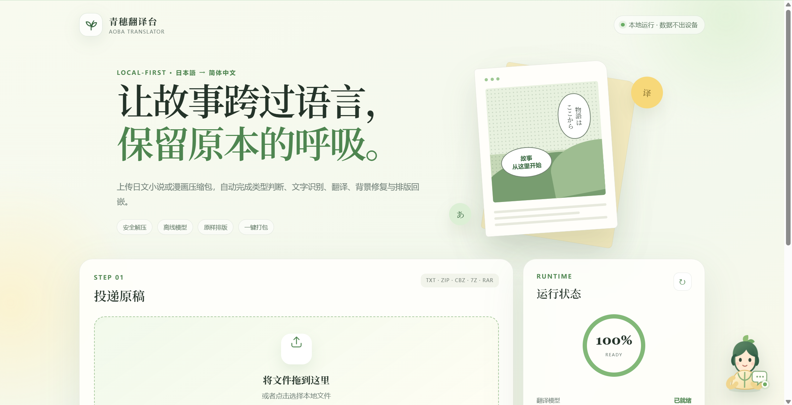
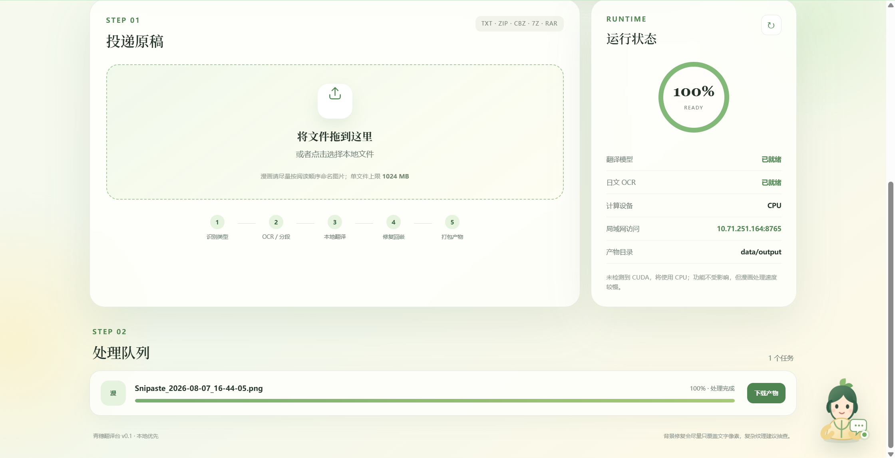
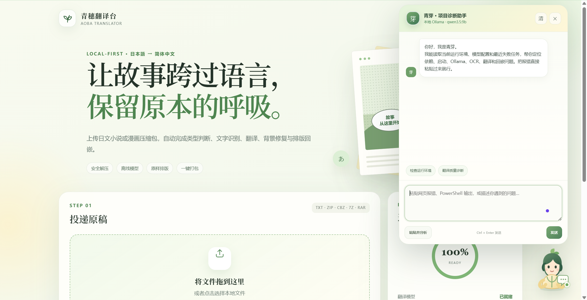

# 青穗翻译台 · 产品图文介绍

> **让故事跨过语言，保留原本的呼吸。**
> 上传日文小说或漫画压缩包，自动完成类型判断、文字识别、翻译、背景修复与排版回嵌——全程本地运行，数据不出设备。

## 一、投递原稿：拖进来，剩下的交给它

首页即工作台。把 `.txt` 小说或 `.zip / .cbz / .7z / .rar` 漫画压缩包拖进上传区，青穗翻译台会自动完成五步流水线：

**识别类型 → OCR / 分段 → 本地翻译 → 修复回嵌 → 打包产物**

右侧运行状态卡实时展示翻译模型与日文 OCR 的就绪情况；未检测到独立显卡时自动使用 CPU，并给出局域网访问地址，手机和同网段设备也能直接使用。

## 二、处理队列：进度可见，产物一键下载

每个任务都有独立卡片，实时显示进度、状态与产物信息。翻译完成后：

- 原样保留目录结构与文件名的译文产物已打包为 ZIP
- `translation-report.json` 记录每个区域的识别、翻译与渲染细节
- 产物始终保留在 `data/output/`，服务重启也不丢失

## 三、本地 AI 项目客服「青芽」—— 装在你电脑里的技术支持

**这是青穗翻译台最独特的能力之一：一个真正跑在本地的 AI 项目客服。**

页面右下角的青芽助手由你机器上的 Ollama 模型驱动（如 qwen3.5:9b），它能做到普通"帮助文档"做不到的事：

- **看得懂你的环境**——对话前自动汇总操作系统、Python/CPU/GPU 检测结果、当前模型配置和最近任务的失败堆栈，诊断一针见血（上图：一句"你好"，它已报出全部运行环境与就绪状态）
- **能接住任何报错**——直接把 PowerShell 输出、网页报错或任务失败信息粘贴给它，失败任务卡片上还有"发给青芽"一键按钮
- **只诊断不越权**——只分析问题、给出建议，不会执行任何命令或修改你的文件

而且它和整个翻译链路一样：**所有对话都在本机完成，聊天记录、项目日志一个字都不会上传到云端。** 翻译内容不出设备，求助记录同样不出设备。

> 遇到问题不用查文档、不用去社区发帖等回复——点一下右下角的青芽，你的专属技术支持已经带着你的日志在场了。
